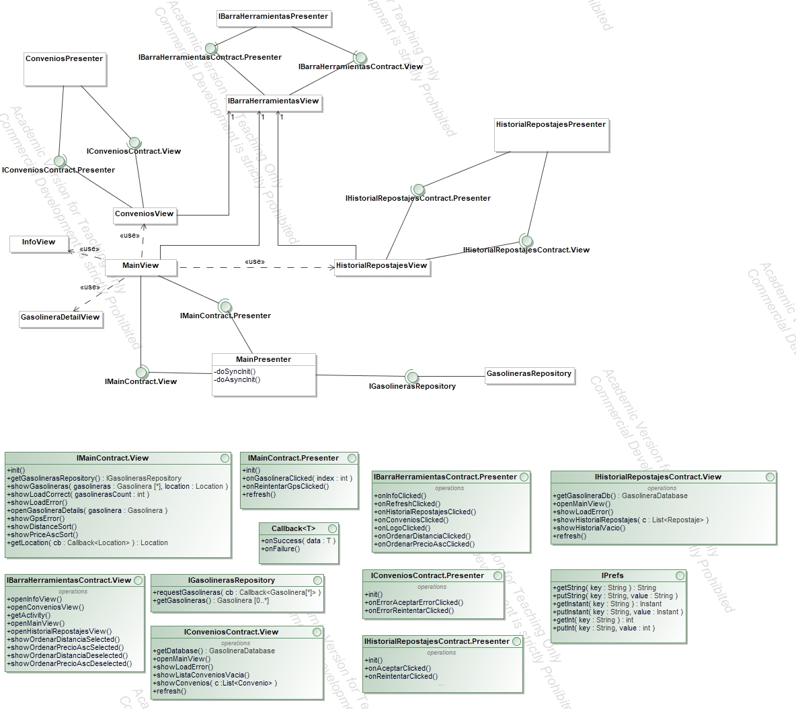

# Proyecto Gasolieras

## Descripción del proyecto

Aplicación realizada en el proyecto integrado del Grado en Ingeniería Informática de la Universidad de Cantabria (Mención en Ingeniería del Software). En este proyecto se buscaba combinar los conocimientos adquiridos en distintas asignaturas para desarrollar una aplicación para dispositivos móviles a medida según las especificaciones de un cliente. Se engloba todo el proyecto desde la captura de requisitos y el diseño a la realización de la aplicación mediante una metodología ágil (Scrum), así como toda la documentación y pruebas del proceso de desarrollo.

Se trata de una aplicación Android que permite la consulta de los precios de combustibles en las distintas gasolineras de Cantabria, diseñada para facilitar la gestión de los repostajes a los transportistas. En la página principal se muestra un listado con los precios de todas las gasolineras, que pueden ser filtradas en función del precio y la distancia con respecto a la posición actual del vehículo. La información de las gasolineras también puede consultarse en una vista de detalle. Igualmente, permite que los transportistas comprueben su listado de convenios (gasolineras o franquicias con las cuales su empresa tiene algún tipo de descuento) y el histórico de respostajes.

## Diseño del sistema

Diagrama de la arquitectura Model-View-Presenter del sistema.

## Habilidades y lenguajes

| Elemento	| Lenguajes					|
|--------------	|-----------------------------------------------|
| Android app	| Android Studio, Java				|
| Testing	| Gradle, Espresso, JUnit, Mockito		| 
| Arquitectura	| Arquitectura MVP (Model-View-Presenter)	|